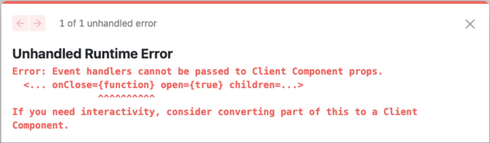
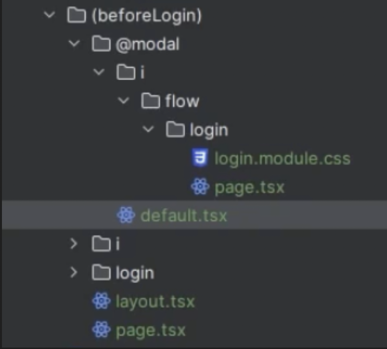

# 1. Intro

## Next.js

React는 화면 그리는 라이브러리.
리액트 라우터, 캐싱, 스타일링, 최적화, 배포 등을 추가하기 위해서는 라이브러리를 사용해야했다.

하지만 그 React 위에서 돌아가는 프레임워크인 Next로 구현 가능.

---

> ## 💡 Framework와 Library의 차이
Library : 개발자로서 내가 사용하는 것
내가 불러오고, 내가 사용해서 무언가를 한다
내가 원하는 대로 코드를 작성할 수 있고, 사용하고 싶을 때 사용할 수 있다
Framework : 내 코드를 불러온다
내 코드를 적절한 위치에 잘 적기만 하면 내 코드를 불러와서 모든 걸 동작하게 한다

### React의 경우
: Library

create-react-app으로 React 앱을 만들면 항상 index.tsx 파일에 아래 부분이 만들어져있고,

```js
ReactDOM.render(
  <React.StrictMode>
  </React.StrictMode>,
  document.getElementById("root")
)
```

항상 App Component로 시작하는데 App은 텅 비어있어서 내가 원하는대로 만들 수 있음.
Components 폴더를 만들거나, Routes 폴더를 만든다. 내가 코드를 짜고, 내가 언제 React를 부를지,
어떤 폴더 구조로 만들지 정하는 것.
이름조차 Component와 Routes라고 할 필요도 없다.

React에서 라우팅을 다루는 방법은(페이지에서 페이지로 넘어가는 방법) 다 나에게 달렸다.

이처럼 Library를 사용할 때는 내가 원할 때 언제든, 어떤 방법으로든 부르면 된다.

### Next의 경우
: Framework

특정한 규칙을 따라서 특정한 것을 해야한다. 이걸 따랐을 때 모든 게 정상적으로 작동한다.

---

### Next는 프론트 + 서버 실행

서버 또한 실행할 수 있다

> 백엔드는 nest 강좌에서 확인

## App Router vs Pages Router

- React 18 서버 컴포넌트 사용
- 레이아웃
  - 여러 페이지를 이동할 때 공통적인 스타일
- 페이지별 권한 체크

## 서버 컴포넌트?

넥스트 서버에서 리액트를 미리 랜더링 후, 클라이언트로 데이터를 보내줄 때 완성된 HTML을 보내준다.

### 완성된 HTML 전달

#### 장점

- HTML 로딩 시간 감소
- JavaScript 용량 감소

#### 단점

- 넥스트 서버에 엄청난 무리
  유저 브라우저에서 했던 일을 넥스트 서버에서 혼자서 다 하기 때문에.

=> 서버 부담을 줄이기 위해 캐싱 필요

App Router에서는 넥스트가 캐싱처리.
(Pages Router일 때에는 캐싱을 스스로 구현해야했다)

# template.tsx, Link, Image, redirect

페이지 넘어갈 때마다
리랜더링 O -> template.tsx
리랜더링 X -> layout.tsx

리랜더링보다는 매번 새롭게 마운팅된다는 개념에 더 가깝다.

따라서 이 둘은 공존할 수 없음.


### redirect

```
import { redirect } from "next/navigation";

redirect("원하는 URL");
```

로그인 없이 진입했을 때 Home(로그인해라)으로 이동하게 될 듯


> 🚨 Error Log

`Error: Event handlers cannot be passed to Client Component props.`

최상단 컴포넌트에 'use client'를 붙이면 된다.
서버 컴포넌트에서 클라이언트 컴포넌트로 함수를 전달하려고 할 때,
함수는 직렬화(serializable)할 수 없기 때문에 문제가 발생.
해당 페이지를 클라이언트 컴포넌트로 전환하는 것이 유일한 해결책.


### Image

next의 Image 태그는 이미지 최적화를 해준다

# 스타일링

## css 스타일링 종류

1. module css

```
import ./global.css
import ./page.module.css
```

같은 위치에 있지만 글로벌한 스타일은 global.css로,
특정 페이지만의 스타일은 page.module.css로

모듈이 알아서 다른 페이지의 클래스 네임과 다르게 처리해줌.

페이지에서 사용은 아래처럼.

```
<div className={styles.left}>
```

2. Styled component

서버 컴포넌트 SSR 쪽에서 문제가 있다.

3. sass

4. Vanilla extract

윈도우와 문제 있음

### 새로운 단위 dvw, dvh

`dvw` : dynamic viewport width
`dvh` : dynamic viewport height

모바일 브라우저에서 주소창 유무에 따른 뷰포트 사이즈 감지


# Parallel Routes

모달이 뜨면 주소가 변경되어야하는데, 기존에 있던 페이지를 그대로 유지해아한다.
그럼에도 페이지와 동시에 보여주고 싶다면?
그럴 때 사용하는 것이 패러렐 라우트.

## default.tsx

default.tsx는 Parallel Routes의 기본값.
패러렐 라우트인데, 패러렐 라우트가 필요가 없을 경우의 기본적인 페이지.
나는 URL이 변경될 필요가 없어서 그냥 만들지 않았다.



페이지 구조가 위 경우일 경우.
기본적으로는 모달이 뜨지 않음. 그때에는 실제로는 아무것도 그리지 않게 null을 return한다.

- localhost:3000일 때에는?
children = page.tsx, modal = @modal/default.tsx
(이게 없으면 페이지를 찾을 수 없어 오류가 난다)

- localhost:3000/i/flow/login일 때에는?
children = i/flow/login/page.tsx, modal = @modal/i/flow/login/page.tsx


# Intercepting Routes

서로 주소가 다른데 같이 뜰 수 있게 해주는 인터셉팅 라우트

<!-- intercept–route-test 브랜치에서 테스트 중.
parallel route까지는 적용 완료 -->


# URL에는 뜨지 않는 route

1. group 폴더
(tableGroup)/

주요역할 : 그룹의 공통 레이아웃 설정 가능

2. pararllel route 폴더

@modal/
@auth/

한 화면에 두 개의 페이지를 동시에 보여주는 용도.

3. private 폴더

_components/

주소창에 뜨지 않는 폴더정리용


# 서버 컴포넌트와 클라이언트 컴포넌트

React 18부터 추가된 서버 서버 컴포넌트 개념.
모든 컴포넌트는 기본적으로 모두 서버 컴포넌트, 이 서버 컴포넌트들은 Next JS 서버에서 돈다.

리액트는 원래 프론트엔드 라이브러리이기 때문에 컴포넌트가 클라이언트에서 돈다.
서버에서 돌기 때문에 컴포넌트에 async를 붙일 수 있다.

대신 useEffect, useState와 같은 훅들을 사용하려면,
반드시 최상단에 "use client"를 붙여 클라이언트 컴포넌트로 변경해야한다.


## What is server component in Next 14


https://nextjs.org/docs/app/building-your-application/rendering/server-components

서버 컴포넌트는 UI를 그리고, 그 UI가 서버에 캐싱할 수 있는 옵션을 제공한다.

