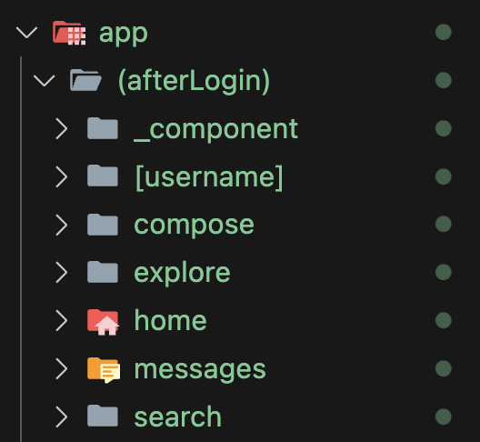
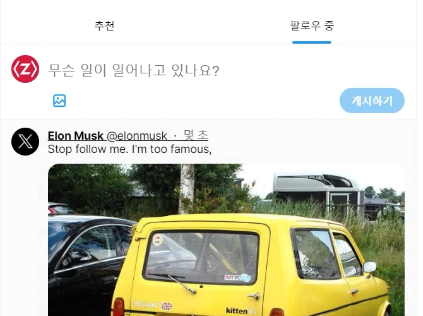
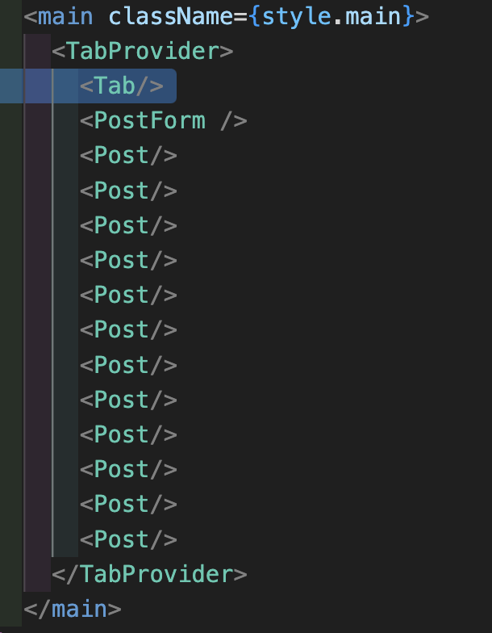

# useSelectedLayoutSegment로 ActiveLink 만들기

내 현재 위치에 따라 버튼의 스타일을 조정해야한다.
내 현재 위치를 알기 위해서는 서버 컴포넌트에서는 불가능.
"use client"로 클라이언트 컴포넌트화 해야함.

라우팅하지 않기 위해 프라이빗 디렉토리 `_component` 생성

### useSelectedLayoutSegment

```tsx
import { useSelectedLayoutSegment } from 'next/navigation';
```
next가 제공하는 훅. 현재 위치를 가져온다.

가장 큰 부모 디렉토리만 노출.

만약 그 자식 디렉토리까지 가져오려면 `useSelectedLayoutSegments`를 사용해야한다.
이 때의 결과값은 스트링 배열로 들어온다.

### 훅, 이벤트 리스너 등이 있으면 "use client"
onClick이 있으면 클라이언트 컴포넌트
(서버 액션도 있지만 실험적이라 이 강좌에서는 다루지 않을 예정)

후에 로그인/로그아웃은 `NextAuth.js`을 사용.


# 오른쪽 섹션 클론코딩

```tsx
<Link href={`/search?q=트렌드`}></Link>
```

실시간 트렌드를 누르면 URL에 검색어 쿼리가 추가되게 추가한다.

# 홈탭 만들면서 context API 적용해보기


### css에서의 변수 적용

css에서도 변수적용이 가능하다.
이걸로 라이트모드/다크모드 편하게 적용 가능

```css
body {
  color: rgb(var(--foreground-rgb));
  background: rgb(var(--background-end-rgb));
}
```

`backdrop-filter` 라는 것도 있구나
```css
.homeFixed {
  backdrop-filter: blur(12px);
}
```


## 탭 상태 변경


추천 탭을 누르면 추천 게시글이, 팔로우 중 탭을 누르면 팔로우 중 게시글이 나와야한다.

상태를 변경해야하기 때문에 클라이언트 컴포넌트여야하고,
이 컴포넌트가 다른 컴포넌트의 상태에도 영향을 줘야한다.

### useState로 처리하지 않는 이유

useState로 해도 됨.
하지만 단순히 탭만 바뀌는 게 아닌 내부의 게시글에도 영향이 가서 상태 관리가 들어가면 좋다.


이 Tab에서 바꾸는 상태로 하위 게시글까지 영향을 받게 하려면?

=> context로 관리하는 상태값을 하위 children에게 전달하기 위해서는
Provider로 children을 감싼다.

# PostForm 만들기

이 강좌에서 사용하는 form은 모두 client component라고 생각.
서버액션으로 바로 서버로 보낼 수도 있지만 아직은 실험단계.

# dayjs 사용해보기

편리한 시분초 계산을 위해 day.js사용.

[npmtrends](https://npmtrends.com/)
라이브러리 사용률 비교하며 사용하면 좋다.

```tsx
import dayjs from "dayjs";
import relativeTime from "dayjs/plugin/relativeTime";
```

fromNow를 사용할 수 있는 플러그인.

```tsx
dayjs.locale("ko");
dayjs.extend(relativeTime);
```

# classnames로 클래스 합성하기

```tsx
      <div className={cx(style.repostButton, reposted && style.reposted)}>
        <button onClick={onClickComment}>
        // 
        </button>
      </div>
```

조건부로  클래스네임을 조합하기 위해 `classnames` 사용.
cx 함수 안에 들어있는 모든 클래스 네임을 조합 가능.