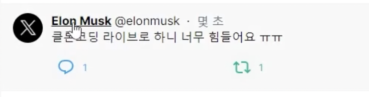

# /compose/tweet 만들기

어느 페이지에서 게시하기를 눌러도 화면은 그대로이지만 모달이 뜨고 (parallel route)
url은 `/compose`로 바뀌어야 함 (intercept-route).

페러렐 라우트와 인터셉팅 모달 구현 필요.

## 페이지 구성

(afterlogin)그룹의 layout에서 children과 함께 모달을 받도록 작성한다.

<!--  -->

탐색하기 `/explore`에서 게시하기를 눌렀을 때는 URL이 그대로 `/explore`여야한다.
=> 인터셉팅 라우트를 구현


# useSearchParams와 프로필, /search 페이지

홈페이지의 탭은 url을 바꾸지 않지만 탐색하기 페이지의 탭은 url을 변경함.
디자인이 같지만 다르게 동작하는 컴포넌트는 다르게 만들어주는 게 좋다.

```tsx
 const onClickHot = () => {
    setCurrent('hot');
    router.replace(`/search?q=${searchParams.get('q')}`)
  }
  const onClickNew = () => {
    setCurrent('new');
    router.replace(`/search?${searchParams.toString()}&f=live`)
  }
```
- `searchParams.toString()`
  기존에 있던 것 그대로 두고 뒤에 `f=live`를 추가하겠다.

마우스를 올렸는데 링크가 뜨지 않는다?
a태그가 아님. 클라이언트에서 라우팅할 가능성이 높다.

# 이벤트 캡처링과 /status/[id] 페이지

## 서버 컴포넌트를 어떻게 가져오는가?

서버 컴포넌트를 클라이언트 컴포넌트로 import해오면?
=> 클라이언트 컴포넌트로 성격이 바뀌어버린다.

서버 컴포넌트가 클라이언트 컴포넌트의 자식일 때는
**서버 컴포넌트를 `children`으로 받아오거나 `prop`으로 전달하면 제대로 작동한다.**

## 중복되는 이벤트 분리하기 react eventCapturing


아이디를 눌렀을 때와 게시글을 눌렀을 때 다른 이벤트가 일어나야하는데,
두개 다 onClick으로 되어있어서 어디를 눌러도 게시글로만 가는 상황.

```tsx
<article onClickCapture={onClick}>
<Link onClick={onClick2}>아이디</Link>
</article>
```

둘 중 하나를 `onClickCapture`로 바꿔주면 된다.

# faker.js와 /photo/[photoid]

faker로 이미지 가져오기 (아래는 이미지 유무 랜덤)

```tsx
  if (Math.random() > 0.5) {
    target.Images.push(
      { imageId: 1, link: faker.image.urlLoremFlickr() },
      { imageId: 2, link: faker.image.urlLoremFlickr() },
      { imageId: 3, link: faker.image.urlLoremFlickr() },
      { imageId: 4, link: faker.image.urlLoremFlickr() }
    );
  }
```


# /messages 페이지 라이브 클론  

배열의 마지막 요소 가져오기

```tsx
user.Messages.at(-1)
```

