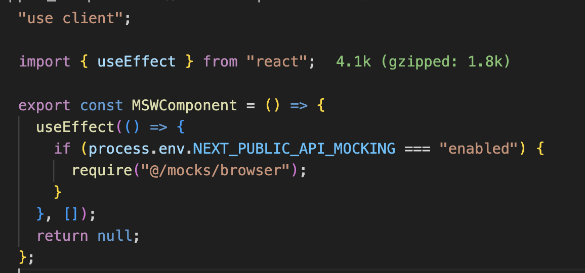

# msw 세팅과 버전 업그레이드

### MSW

Mock Service Worker. 개발환경에서의 네트워크 요청을 브라우저 단에서 인터셉트에서 사전에 지정한 응답을 주도록 하는 라이브러리

- 기본은 브라우저에서 돌지만 nextjs처럼 ssr 프레임워크에서는 node에서도 동작하도록 별도 설정 추가 가능

MSW로 API가 없어도 요청을 보낼 수 있다.
요청에 대한 응답을 직접 MSW로 만들어줘야함

### 1. package.json 설정

최하단에 아래 내용을 추가한다

```json
  "msw": {
    "workerDirectory": "public"
  }
```

### 2. 설치

```bash
yarn add msw init public/ --save-dev
```

위치를 public으로 지정했기 때문에 아래와 같이 `mockServiceWorker.js` 파일이 생성된다.


### API가 있어도 MSW 활용이 가능하다

에러 케이스를 테스트해보고 싶을 때도 사용 가능.
msw가 API 요청에 대한 응답으로 에러를 주도록 설정할 수 있음.
에러 상황을 억지로 만들어낼 필요 없이 서비스 워커의 응답을 에러로 만들면 된다.

> Next에서는 서버에서도 클라이언트에서도 돌아야하는데, 서버쪽에서 목비스워커를 돌리는 방식이 안나왔다.
> 그래서 임시로 노드서버를 함께 돌려줌

### HTTP cookie 세팅

```json
{
  "headers": {
    "Set-cookie": "connect.sid=msw-cookie'HttpOnly;Path=/"
  }
}
```

HTTP, 헤더 공부하기 (백엔드의 코드도 대략 비슷함)

### package.json에 노드서버 시작 스크립트 설정

```json
"mock": "yarn tsx watch ./src/mocks/https.ts"
```

코드 수정하면 알아서 서버가 재시작됨.

# next용 msw 컴포넌트와 .env

언제 MSW를 적용하고 언제 MSW를 적용하지 않을지 판단하는 컴포넌트 생성.



`layout.tsx`의 body 바로 아래에 위치시켜주면,
클라이언트 환경에서는 `mockServiceWorker.js` 파일이 요청을 가로챈다.
가로채서 우리가 작성한 http 서버로 보냄.

### 환경변수 세팅

NEXT_PUBLIC_API_MOCKING=enabled

앞에 NEXT_PUBLIC을 붙이면 브라우저에서 접근 가능한 환경변수.
없는 환경변수는 서버에서만 접근 가능하고 브라우저에서 접근 불가.

브라우저가 접근 가능한 환경변수는 개발자도구에서 모든 사람이 접근 가능하다.

### 브라우저 환경 보장

```ts
if (typeof window !== "undefined") {
  if (process.env.NEXT_PUBLIC_API_MOCKING === "enabled") {
    require("@/mocks/browser");
  }
}
```

window가 있는 경우 === 클라이언트 환경

# 서버 컴포넌트에서 Server Actions 사용하기

우선 훅을 모두 없애야한다. 그럼 동작을 어떻게 하는가?
<리액트는 잊고 html과 javascript에서 어떻게 동작했는지 생각하기>

onClick 액션은 클라이언트 컴포넌트로 따로 분리.

### 서버 컴포넌트 사용

클라이언트 컴포넌트 안에서 서버컴포넌트를 사용할 때에는 "use server"를 붙여주기.
(프론트엔드 서버) 그럼 이건 서버컴포넌트가 되어서 내부 코드는 브라우저에 노출되지 않는다.

- 기존의 단계 : 브라우저-서버-DB
- 현재의 단계 : 브라우저-DB

여기서 바로 DB 접속해서 데이터를 가져올 수 있다.

form 데이터로 한번에 받으려면 id 속성 외의 name 속성이 필요하다.
form 데이터의 name으로 데이터를 직접 가져올 수 있다.

## 쿠키 - credentials 설정이 왜 필요한가?

쿠키가 있어야만 로그인 유무를 알 수 있다.
하지만 브라우저가 제공하는 요청 API는 브라우저의 쿠키와 같은 인증과 관련된 데이터를 요청 데이터, 또는 응답 데이터에 담지 않는다.
요청과 응답에 쿠키를 포하하고 싶다면 `withCredentials` 옵션을 사용.

현재 클라이언트는 localhost:3000, 서버는 localhost:9090.
_이때 CORS 에러가 발생한다_
클라이언트나 서버나 둘다 Credentials를 true로 설정해야한다.

표준 CORS요청은 기본적으로 쿠키를 설정하거나 보낼 수 없다.
프론트에서 ajax 요청할 때, withCredentials부분을 true로 해서 수동으로 CORS 요청에 쿠키값을 넣어줘야 한다.
마찬가지로 서버도 응답헤더에 Access-Control-Allow-Credentials를 true로 설정해야 한다.

### 클라이언트에서는

- axios일 경우

  - withCredentials 옵션 부분을 axios 전역 설정으로 처리
  - 또는 axios 요청 메소드의 옵션 인자로 넣어 전달

  ```js
  axios
    .post("url", { username: username }, { withCredentials: true })
    .then((response) => {
      console.log(response);
      console.log(response.data);
    });
  ```

- fetch일 경우

```js
fetch("url", {
  method: "POST",
  credentials: "include", // 클라이언트와 서버가 통신할때 쿠키 값을 공유하겠다는 설정
});
```

### 서버에서는

서버에서도 설정이 필요하다.
만일 서버에서 별도의 처리 없이 클라이언트만 withCredentials으로 서버에 cors 요청하게 되면 모두 거부된다.

- node일 경우
  서버에 response 헤더(Header) 값으로 Access-Control 설정을 해준다.

  ```js
  response.setHeader("Access-Control-Allow-origin", "*"); // 모든 출처(orogin)을 허용
  response.setHeader(
    "Access-Control-Allow-Methods",
    "GET, POST, OPTIONS, PUT, PATCH, DELETE"
  ); // 모든 HTTP 메서드 허용
  response.setHeader("Access-Control-Allow-Credentials", "true"); // 클라이언트와 서버 간에 쿠키 주고받기 허용
  ```

- express일 경우

```js
const express = require("express");
const cors = require("cors");

const app = express();

app.use(
  cors({
    origin: "*", // 출처 허용 옵션
    credential: "true", // 사용자 인증이 필요한 리소스(쿠키 ..등) 접근
  })
);
```

현재 우리가 이와 같은 경우
