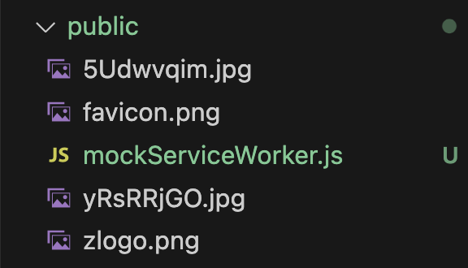

# msw 세팅과 버전 업그레이드

### MSW

Mock Service Worker. 개발환경에서의 네트워크 요청을 브라우저 단에서 인터셉트에서 사전에 지정한 응답을 주도록 하는 라이브러리

- 기본은 브라우저에서 돌지만 nextjs처럼 ssr 프레임워크에서는 node에서도 동작하도록 별도 설정 추가 가능

MSW로 API가 없어도 요청을 보낼 수 있다.
요청에 대한 응답을 직접 MSW로 만들어줘야함

### 1. package.json 설정

최하단에 아래 내용을 추가한다

```json
  "msw": {
    "workerDirectory": "public"
  }
```

### 2. 설치

```bash
yarn add msw init public/ --save-dev
```

위치를 public으로 지정했기 때문에 아래와 같이 `mockServiceWorker.js` 파일이 생성된다.


### API가 있어도 MSW 활용이 가능하다

에러 케이스를 테스트해보고 싶을 때도 사용 가능.
msw가 API 요청에 대한 응답으로 에러를 주도록 설정할 수 있음.
에러 상황을 억지로 만들어낼 필요 없이 서비스 워커의 응답을 에러로 만들면 된다.
